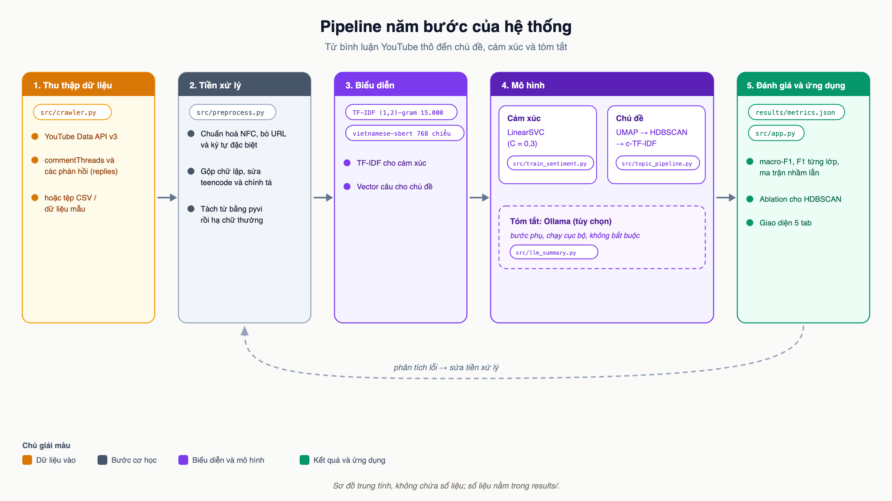
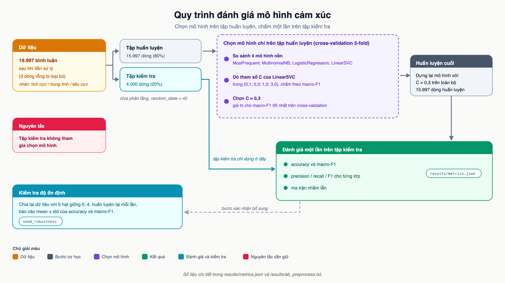
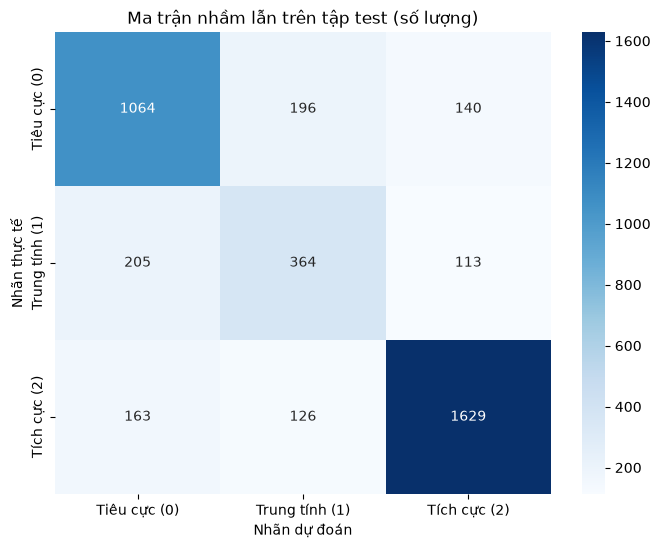
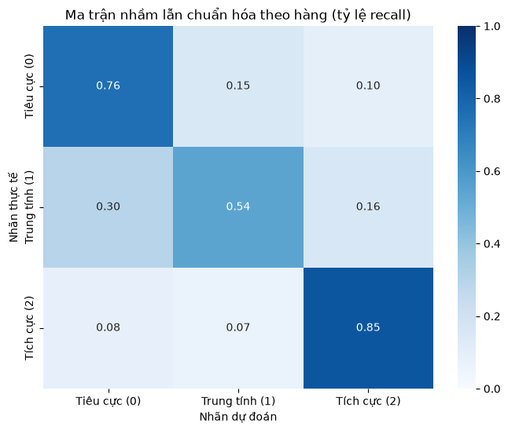
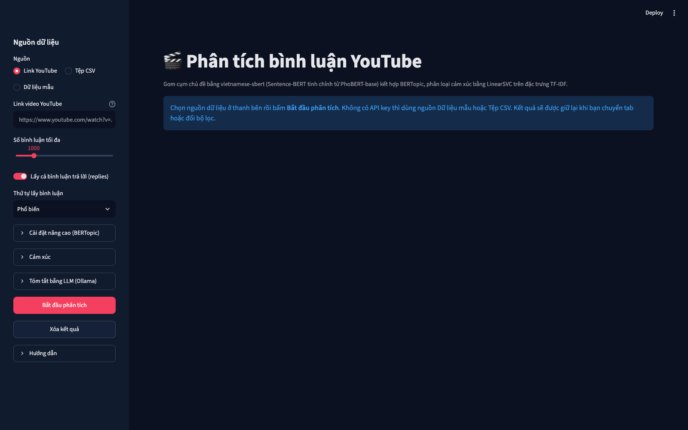
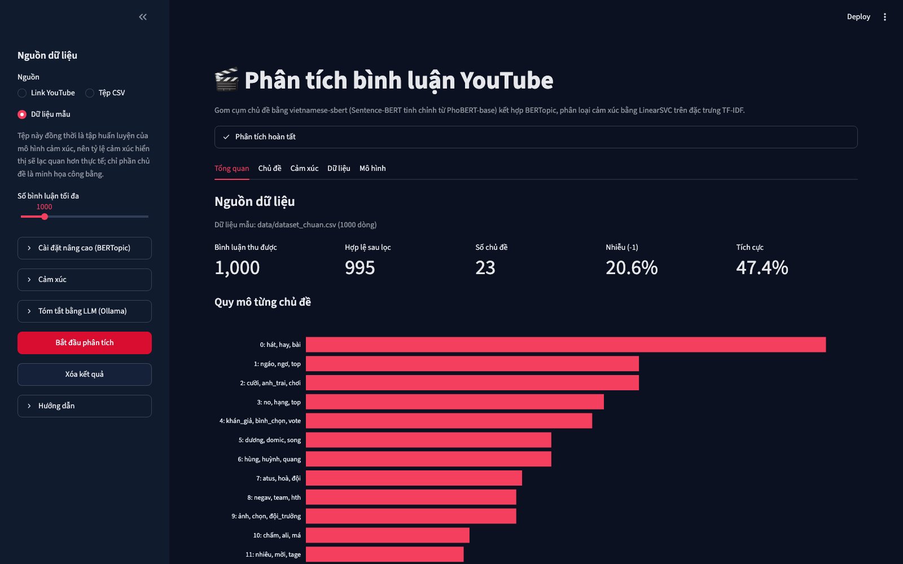
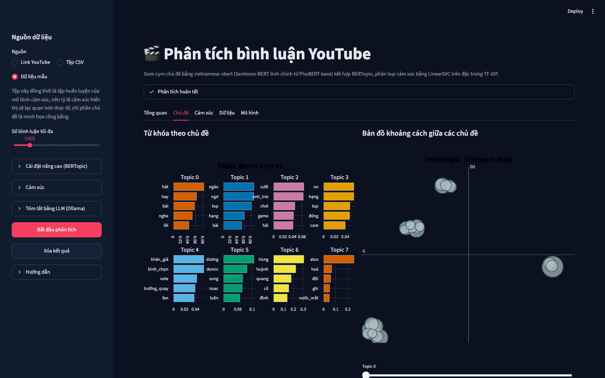
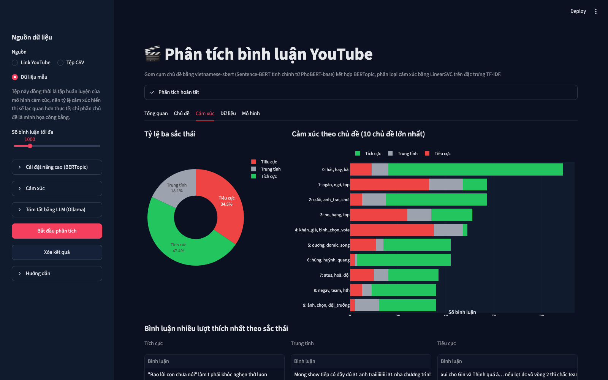

# Phân tích chủ đề và cảm xúc bình luận YouTube tiếng Việt

**Báo cáo đồ án môn Xử lý ngôn ngữ tự nhiên**

Lớp: CS221.F31.LT.TTNT

Giảng viên: NCS.ThS Đặng Văn Thìn

Nhóm: [danh sách thành viên và mã số sinh viên]

Tháng 9 năm 2026

> Quy ước số trong báo cáo: dấu phẩy là dấu thập phân (0,7161; 77,58%), dấu chấm tách hàng nghìn (20.000), trong cả văn xuôi lẫn bảng. Tên tệp nguồn viết trong định dạng mã (`results/metrics.json`); mỗi bảng số liệu ghi rõ tệp bằng chứng của mình trong cột nguồn hoặc trong đoạn dẫn vào bảng. Mọi chỉ số đo trên tập kiểm tra tách riêng, cấu hình chọn bằng cross-validation trên tập huấn luyện, trừ chỗ ghi khác. Phụ lục A cho biết lệnh tái lập và vị trí của từng con số.

## Tóm tắt

Đồ án giải bài toán đọc hàng nghìn bình luận dưới một video YouTube tiếng Việt thay cho người xem. Đầu ra gồm hai phần: các chủ đề người xem đang bàn, mỗi chủ đề mô tả bằng 10 từ khóa và vài bình luận tiêu biểu, và phân bố cảm xúc theo ba lớp tiêu cực, trung tính, tích cực. Dữ liệu huấn luyện là 20.000 bình luận có nhãn về một chương trình duy nhất, lớp trung tính chỉ chiếm 17,0%.

Hệ thống đi qua năm bước: dữ liệu, tiền xử lý, biểu diễn, mô hình, đánh giá. Tiền xử lý chuẩn hóa Unicode, teencode và chữ lặp, rồi tách từ bằng pyvi trước khi hạ chữ thường. Hai bài toán con dùng hai cách biểu diễn: vector câu 768 chiều từ mô hình Sentence-BERT tiếng Việt cho gom cụm chủ đề bằng BERTopic, và TF-IDF unigram cộng bigram cho phân loại cảm xúc bằng LinearSVC. Mọi bước chọn mô hình chạy bằng cross-validation 5-fold trên 15.997 dòng huấn luyện; 4.000 dòng kiểm tra được đánh giá đúng một lần. Toàn bộ pipeline đóng gói thành ứng dụng Streamlit kèm 146 kiểm thử tự động.

Ba kết quả chính. Một, mô hình cảm xúc đạt macro-F1 0,7161 trên tập kiểm tra và 0,7200 ± 0,0037 trên năm hạt giống; lớp trung tính là giới hạn với F1 0,5354. Hai, LinearSVC với C = 0,3 và LogisticRegression cách nhau 0,0010 macro-F1, nhỏ hơn độ lệch chuẩn giữa các fold; phần cải thiện đo được đến từ việc dò C (0,7054 lên 0,7180), còn thay đổi tiền xử lý là trung tính đối với bộ phân loại. Ba, `min_samples` của HDBSCAN quyết định kết quả chủ đề: tham số mặc định của BERTopic đẩy 49,2% bình luận vào nhiễu, còn cấu hình kích thước cụm tối thiểu 15 và `min_samples` 1 cho 26 chủ đề với 33,3% nhiễu trên 1.493 bình luận. Hạn chế cần đọc kèm mọi con số: nhãn là nhãn silver do mô hình ngôn ngữ lớn gán tự động, chưa được người kiểm tra từng dòng, và theo chính tác giả dữ liệu thì lớp trung tính là lớp nhiễu nhất (mục 2.1). Phần đọc tay 150 bình luận ở mục 7 đồng thời là bước kiểm tra chất lượng nhãn mà tác giả khuyến nghị.

\newpage

## 1. Giới thiệu

Bài toán của đồ án: cho tập bình luận dưới một video YouTube tiếng Việt, hệ thống trả về hai đầu ra. Thứ nhất là các chủ đề mà người xem đang bàn tới, mỗi chủ đề được mô tả bằng một nhóm từ khóa và vài bình luận tiêu biểu. Thứ hai là phân bố cảm xúc của bình luận theo ba lớp: tiêu cực, trung tính, tích cực. Người dùng mục tiêu là người cần nắm nội dung hàng nghìn bình luận mà không thể đọc từng dòng.

Bình luận YouTube tiếng Việt khó xử lý hơn văn bản báo chí vì năm lý do. Người viết dùng teencode và viết tắt (`ko`, `đc`, `j`), nhiều bình luận không gõ dấu, emoji xuất hiện trong 34,5% bình luận của tập dữ liệu (71,2% nếu tính cả dấu câu), câu rất ngắn (độ dài trung vị 52 ký tự), và một phần không nhỏ mang tính châm biếm hoặc vừa khen vừa chê. Thêm vào đó, tiếng Việt không đánh dấu ranh giới từ bằng khoảng trắng, nên bước tách từ quyết định chất lượng của cả từ khóa chủ đề lẫn đặc trưng phân loại.

Đồ án đi theo đúng năm bước của môn học (dữ liệu, tiền xử lý, biểu diễn, mô hình, đánh giá) và đóng góp ở hai mặt. Về phương pháp, chúng tôi ghép hai hướng biểu diễn khác nhau cho hai bài toán con: vector câu 768 chiều từ mô hình Sentence-BERT tiếng Việt cho việc gom cụm chủ đề bằng BERTopic, và TF-IDF n-gram cho việc phân loại cảm xúc bằng LinearSVC huấn luyện trên 20.000 bình luận có nhãn. Về thực nghiệm, mọi lựa chọn đều có đối chứng: bốn mô hình nền và lưới tham số C cho phân loại cảm xúc, so sánh hai phiên bản tiền xử lý trên năm hạt giống, và bảng khảo sát tham số HDBSCAN cho phần chủ đề. Toàn bộ pipeline được đóng gói thành một ứng dụng Streamlit và một bộ 146 kiểm thử tự động.



\newpage

## 2. Dữ liệu

### 2.1. Nguồn gốc và cách gán nhãn

Tập dữ liệu huấn luyện là `data/dataset_chuan.csv`, gồm hai cột `text` và `label`. Tệp này là hai cột `text` và `label` của `atsh_sentiment_20k.csv` trong gói dữ liệu ATSH-NLP-20k, đã đối chiếu từng dòng: 20.000 dòng, cùng thứ tự, cùng nhãn. Mọi thông tin về nguồn gốc dưới đây lấy từ README của tác giả gói dữ liệu, được sao chép nguyên văn tại `data/README_ATSH_NLP_20k_goc.md`.

"Dữ liệu được cung cấp bởi dự án ATSH-ABSA (Phạm Xuân Vĩnh Hà, UIT), chỉ dùng cho mục đích học tập."

| Mục | Nội dung theo README của tác giả |
|---|---|
| Nguồn | Trích từ dự án nghiên cứu ATSH-ABSA của Phạm Xuân Vĩnh Hà (UIT, ĐHQG TP.HCM). Lấy từ bản gán nhãn tự động (silver), không lấy từ bản gán nhãn thủ công (gold); không có bình luận nào trùng với bộ gold. |
| Nội dung | Bình luận YouTube tiếng Việt về chương trình Anh Trai Say Hi, mùa 1, tập 1 đến 14. |
| Cách gán nhãn | Nhãn do mô hình ngôn ngữ lớn gán tự động theo một bộ hướng dẫn gán nhãn, theo từng đối tượng (chương trình hoặc nghệ sĩ) và từng khía cạnh (chuyên môn, ngoại hình/phong cách, tính cách, độ nổi tiếng), rồi gộp thành một nhãn tổng thể (quy tắc gộp ở mục 2.3). Chưa được người kiểm tra từng dòng. Tác giả ghi nhãn trung tính là nhãn nhiễu nhất và khuyên kiểm tra thủ công 100 đến 200 dòng của tập test rồi ghi tỉ lệ nhãn đúng vào báo cáo. |
| Lấy mẫu lại | Dữ liệu gốc khoảng 88% tích cực. Bộ này lấy toàn bộ bình luận trung tính hợp lệ, 7.000 bình luận tiêu cực, phần còn lại lấy từ bình luận tích cực; chọn mẫu với seed 42. Tỉ lệ nhãn vì vậy không phản ánh tỉ lệ thật trên YouTube. |
| Bộ lọc | Không phải spam, có liên quan tới chương trình, có thể hiện cảm xúc, dài 5 đến 500 ký tự; đã loại bình luận trùng nhau và bình luận có chứa đường link. |
| Dữ liệu cá nhân | Không có tên tài khoản hay thông tin của người bình luận. Tệp của nhóm chỉ giữ hai cột `text` và `label`. |
| Phần còn lại của gói gốc | Cột `tap` (TAP1 đến TAP14), `doi_tuong` (`nghe_si`, `chuong_trinh`, `ca_hai`), `nghe_si` (tối đa 3 tên); bộ chia sẵn train/val/test 15.999 / 2.000 / 2.001 (80/10/10, phân tầng theo nhãn); `atsh_kol_aspect.csv` gồm 11.766 cặp bình luận và nghệ sĩ kèm nhãn cảm xúc theo 4 khía cạnh. Nhóm không dùng các phần này; phép chia ở mục 2.4 là của nhóm. |
| Điều kiện sử dụng | "Chỉ dùng cho học tập trong khuôn khổ môn học. Không công bố lại, không đưa lên GitHub, Kaggle, Hugging Face hay bất kỳ nơi công khai nào, và không dùng cho bài báo khi chưa có sự đồng ý của tác giả." |

Theo điều kiện trên, mã nguồn và tệp dữ liệu của đồ án chỉ nộp cho môn học, không đưa lên nơi công khai.

### 2.2. Thống kê

| Chỉ số | Giá trị | Nguồn |
|---|---|---|
| Số dòng | 20.000 | `data/dataset_chuan.csv` |
| Nhãn 0, tiêu cực | 7.000 (35,0%) | cùng tệp |
| Nhãn 1, trung tính | 3.409 (17,0%) | cùng tệp |
| Nhãn 2, tích cực | 9.591 (48,0%) | cùng tệp |
| Dòng trùng nội dung | 0 | `results/dataset_stats.json` (script `experiments/dataset_stats.py`) |
| Dòng thiếu giá trị | 0 | cùng tệp |
| Độ dài bình luận | 5 đến 500 ký tự, trung vị 52 | cùng tệp |
| Bình luận có 3 chữ cái giống nhau liên tiếp trở lên | 7,75% (20,7% nếu tính cả dấu câu và emoji lặp) | cùng tệp |
| Bình luận có emoji | 34,5% | cùng tệp |
| Bình luận có dấu câu | 51,5% | cùng tệp |
| Bình luận có emoji hoặc dấu câu | 71,2% | cùng tệp |
| Dòng rỗng sau tiền xử lý | 3 (còn 19.997 dòng, nhãn 2 còn 9.588) | `results/metrics.json`, khóa `dataset` |

Hai điểm cần đọc kỹ. Số 7.000 tròn cho nhãn 0 và tổng 20.000 tròn là kết quả của bước lấy mẫu lại do tác giả gói dữ liệu thực hiện (mục 2.1): giữ toàn bộ bình luận trung tính hợp lệ, lấy 7.000 bình luận tiêu cực, phần còn lại lấy từ bình luận tích cực, trong khi dữ liệu gốc khoảng 88% tích cực. Tỉ lệ ba lớp trong bảng vì vậy do tác giả chọn để giảm mất cân bằng, không phản ánh tỉ lệ thật trên YouTube, và mọi số đo ở mục 6 đều đo trên phân bố này. Toàn bộ bình luận đều nói về một chương trình duy nhất, "Anh Trai Say Hi", nên các con số ở mục 6 chỉ có giá trị trong miền đó; hệ quả được bàn ở mục 9.

### 2.3. Định nghĩa ba nhãn

Ba nhãn dùng theo quy ước của tệp dữ liệu: `0` tiêu cực, `1` trung tính, `2` tích cực. Theo README của tác giả, nhãn gốc được gán theo từng đối tượng (chương trình hoặc nghệ sĩ) và từng khía cạnh (chuyên môn, ngoại hình/phong cách, tính cách, độ nổi tiếng), rồi gộp thành một nhãn tổng thể: có ít nhất một nhãn tích cực thì tích cực; không có nhãn tích cực nhưng có nhãn tiêu cực thì tiêu cực; chỉ có nhãn trung tính thì trung tính. Bình luận vừa có nhãn tích cực vừa có nhãn tiêu cực đã bị loại. Đọc lại từ dữ liệu, chúng tôi thấy lớp `0` là chê, thất vọng, bức xúc; lớp `2` là khen, yêu thích, cảm động; lớp `1` là nhận xét không nghiêng về khen hay chê, câu hỏi, câu kể, và cả những câu vừa khen vừa chê nhẹ. Điểm cuối khớp với ghi chú của tác giả rằng trung tính là nhãn nhiễu nhất: một số câu chê nhẹ hoặc khen nhẹ vẫn được gán trung tính.

### 2.4. Chia tập huấn luyện và kiểm tra

Sau tiền xử lý, 19.997 dòng được chia phân tầng theo nhãn thành 15.997 dòng huấn luyện và 4.000 dòng kiểm tra với hạt giống 42 (`results/metrics.json`, khóa `split`). Mọi bước chọn mô hình và dò tham số chỉ dùng tập huấn luyện bằng cross-validation 5-fold; tập kiểm tra được đánh giá đúng một lần ở mục 6.

\newpage

## 3. Tiền xử lý

### 3.1. Các bước, theo đúng thứ tự trong mã nguồn

Hàm `clean_text` trong `src/preprocess.py` chạy lần lượt:

1. Chuẩn hóa Unicode về dạng NFC (bình luận gõ trên macOS và iOS có thể ở dạng NFD, khi đó các bước sau khớp sai).
2. Bỏ URL.
3. Bỏ ký hiệu `@` và `#` nhưng giữ chữ đứng sau (`#anhtraisayhi` thành `anhtraisayhi`).
4. Thay dấu gạch dưới người dùng gõ bằng khoảng trắng, để không nhầm với dấu gạch dưới mà pyvi thêm ở bước tách từ.
5. Thay dấu câu, ký tự đặc biệt và emoji bằng khoảng trắng. Emoji vì vậy bị xóa; đây là hạn chế đã biết (mục 9).
6. Rút chuỗi ba chữ cái giống nhau liên tiếp trở lên về một chữ (`luônnnn` thành `luôn`). Riêng từ chỉ gồm một chữ cái lặp (`kkkk`, `hhhh`) là tiếng cười, bị bỏ hẳn: nếu rút thành `k` thì bước teencode sẽ đổi thành `không` và tự thêm nghĩa phủ định không có trong bình luận.
7. Chuẩn hóa teencode theo từ trọn vẹn, không phân biệt hoa thường.
8. Gộp khoảng trắng thừa.

Sau đó `tokenize_vietnamese` tách từ bằng pyvi rồi mới hạ chữ thường. Hàm `preprocess_text` ghép hai hàm này; cả huấn luyện lẫn ứng dụng đều gọi đúng hàm đó, nên đặc trưng lúc dự đoán khớp với lúc huấn luyện.

### 3.2. Vì sao tách từ trước khi hạ chữ thường

pyvi phân biệt chữ hoa và chữ thường khi ghép tên riêng. Kiểm tra trực tiếp ngày 18-09-2026: `ViTokenizer.tokenize("Đông Hùng hát")` trả về `Đông_Hùng hát`, còn với đầu vào đã hạ chữ thường trả về `đông hùng hát`, tức là hai âm tiết rời. Phiên bản đầu của đồ án hạ chữ thường ngay trong bước làm sạch, nên cụm `đông_hùng` mà báo cáo cũ lấy làm ví dụ thực ra chưa bao giờ được tạo ra. Phiên bản hiện tại giữ nguyên chữ hoa qua `clean_text`, tách từ, rồi mới hạ chữ thường; nhờ vậy tên riêng như `Đông_Hùng` là token đơn trong cả từ khóa chủ đề lẫn đặc trưng TF-IDF. Thứ tự này chỉ đem lại lợi ích cho tên riêng: các từ ghép thông thường như `chương_trình`, `khán_giả` được pyvi ghép đúng dù đầu vào viết hoa hay viết thường (kiểm tra cùng ngày).

### 3.3. Nguyên tắc của từ điển teencode

Từ điển chỉ chuẩn hóa biến thể chính tả của cùng một từ về dạng chuẩn: `ko`, `k`, `hok`, `khong` thành `không`; `đc`, `dc` thành `được`; `j` thành `gì`; `oke`, `okie` thành `ok`. Từ điển không dịch tiếng lóng hay từ chửi sang một từ mang sắc thái cảm xúc. Phiên bản cũ có các ánh xạ `ok` thành `tốt`, `vcl` thành `rất`, `đkm` thành `tồi`, và `sp` thành `sản phẩm` (một ánh xạ của miền thương mại điện tử, không phù hợp với bình luận YouTube). Những ánh xạ này là tự gán nhãn cảm xúc cho dữ liệu trước khi mô hình được học; chúng tôi bỏ chúng và để bộ phân loại tự học trọng số của các token đó từ 20.000 mẫu có nhãn.

### 3.4. Từ dừng chỉ dùng cho từ khóa chủ đề

Tệp `src/resources/vietnamese_stopwords.txt` có 236 mục do nhóm tự biên soạn, viết ở dạng đã tách từ (`như_thế_nào`, `tuy_nhiên`) để khớp trực tiếp với token của pyvi. Danh sách chỉ giữ hư từ và tiểu từ kiểu chat; từ mang nội dung hoặc sắc thái (`hay`, `hát`, `buồn`, `đỉnh`) không có trong đó vì đó chính là thứ mô hình chủ đề cần thấy.

Danh sách này chỉ được đưa vào `CountVectorizer` của bước c-TF-IDF (mục 4.3), không đưa vào TF-IDF của bộ phân loại cảm xúc. Lý do: `không` và các từ phủ định khác nằm trong danh sách từ dừng, trong khi `không` là đặc trưng có trọng số dương lớn nhất của lớp tiêu cực (+2,93 trong `results/top_features.txt`). Loại từ dừng ở đây sẽ làm mất chính tín hiệu phủ định.

### 3.5. So sánh hai phiên bản tiền xử lý

Để biết thay đổi tiền xử lý ảnh hưởng thế nào tới bộ phân loại, chúng tôi chạy cùng một pipeline TF-IDF + LinearSVC với hai phiên bản tiền xử lý trên năm hạt giống chia tập (0 đến 4). Phiên bản cũ là bản sao đóng băng của mã tiền xử lý ban đầu (`experiments/preprocess_baseline.py`); phiên bản mới là `src/preprocess.py` hiện tại. Script `experiments/ab_preprocess.py` ghi kết quả vào `results/ab_preprocess.txt` và `results/ab_preprocess.csv`. Giá trị trong bảng là trung bình ± độ lệch chuẩn mẫu (ddof = 1) trên năm hạt giống.

| Tiền xử lý | C | Tỉ lệ dự đoán đúng (accuracy) | Macro-F1 | F1 lớp trung tính |
|---|---|---|---|---|
| Cũ (hạ chữ thường trước, từ điển teencode cũ) | 0,3 | 77,58% ± 0,47 | 0,7199 ± 0,0052 | 0,5218 |
| Mới (tách từ trước, từ điển chỉ chuẩn hóa chính tả) | 0,3 | 77,58% ± 0,50 | 0,7200 ± 0,0041 | 0,5222 |
| Cũ | 1,0 | 76,61% ± 0,40 | 0,7079 ± 0,0052 | 0,5004 |
| Mới | 1,0 | 76,57% ± 0,43 | 0,7075 ± 0,0053 | 0,5007 |

Script còn chạy riêng hạt giống 42 với phiên bản mới, C = 0,3: 76,62% và macro-F1 0,7161, trùng đúng với kết quả trên tập kiểm tra ở mục 6.1. Lưu ý về hai giá trị ±: `results/metrics.json` (khóa `seed_robustness`) tính độ lệch chuẩn trên cùng năm hạt giống với ddof = 0 và cho 77,58% ± 0,44, còn bảng này dùng ddof = 1 và cho ± 0,50; cùng năm con số, hai cách tính.

Kết luận: đối với bộ phân loại cảm xúc, thay đổi tiền xử lý là trung tính; mọi chênh lệch đều nằm trong một độ lệch chuẩn. Chúng tôi giữ phiên bản mới không phải vì nó tăng điểm phân loại, mà vì hai lý do khác: tên riêng như `Đông_Hùng` nay là token đơn trong từ khóa chủ đề (mục 3.2), và từ điển teencode không còn áp đặt sắc thái cảm xúc lên dữ liệu (mục 3.3).

\newpage

## 4. Biểu diễn

### 4.1. TF-IDF n-gram cho phân loại cảm xúc

Văn bản đã tách từ được đưa qua `TfidfVectorizer` với `ngram_range=(1, 2)`, `max_features=15000`, `sublinear_tf=True` (`results/metrics.json`, khóa `features`). Bigram là cần thiết vì phủ định trong tiếng Việt đứng trước từ được phủ định: `không hay`, `không thích` là hai trong năm đặc trưng mạnh nhất của lớp tiêu cực, còn `hay mà`, `hay nhưng` là đặc trưng của lớp trung tính (`results/top_features.txt`). Với unigram thuần, `hay` sẽ kéo cả ba câu về lớp tích cực.

### 4.2. Vector câu 768 chiều cho gom cụm chủ đề

Mỗi bình luận đã tách từ được mã hóa bằng `keepitreal/vietnamese-sbert`, một mô hình Sentence-BERT tiếng Việt. Thẻ mô hình không nêu mô hình gốc; chúng tôi suy ra nó được tinh chỉnh từ PhoBERT-base dựa trên `config.json` của mô hình trên Hugging Face Hub: `_name_or_path` là `sentence_phobert_nli`, kiến trúc RoBERTa, 12 tầng, kích thước ẩn 768, bộ tách từ `PhobertTokenizer` với từ vựng 64.001, `max_position_embeddings` 258. Theo thẻ mô hình sentence-transformers: `max_seq_length` 256, mean pooling, huấn luyện bằng `CosineSimilarityLoss`. Kết quả là một vector câu 768 chiều cho mỗi bình luận.

PhoBERT được huấn luyện trên văn bản đã tách từ, nên bước pyvi phía trước là định dạng đầu vào mà mô hình nhúng mong đợi, chứ không chỉ phục vụ từ khóa. Trên máy thử nghiệm (Apple Silicon, MPS), mã hóa 1.496 bình luận mất 3,4 giây.

### 4.3. c-TF-IDF: cách BERTopic chọn từ khóa cho một cụm

Sau khi gom cụm, BERTopic nối tất cả bình luận của một cụm thành một văn bản và tính trọng số cho từng từ theo công thức c-TF-IDF (Grootendorst, 2022):

W(t, c) = tf(t, c) × log(1 + A / f(t))

trong đó tf(t, c) là tần suất của từ t trong cụm c, f(t) là tổng tần suất của t trên mọi cụm, và A là số từ trung bình của một cụm. Từ nào xuất hiện nhiều trong cụm này và ít ở các cụm khác sẽ có trọng số cao.

Ví dụ với ba cụm và bốn từ, mỗi cụm có tổng 10 từ (nên A = 10; BERTopic còn chia tf cho tổng số từ của cụm, ở đây các cụm bằng nhau nên phép chia không đổi thứ hạng). Logarit là logarit tự nhiên.

| Từ | Cụm 1 | Cụm 2 | Cụm 3 | f(t) | log(1 + 10/f(t)) |
|---|---|---|---|---|---|
| hát | 6 | 0 | 0 | 6 | log(2,667) = 0,981 |
| hạng | 0 | 6 | 0 | 6 | 0,981 |
| quảng_cáo | 1 | 1 | 6 | 8 | log(2,25) = 0,811 |
| hay | 3 | 3 | 4 | 10 | log(2) = 0,693 |

Trọng số của cụm 1: `hát` 6 × 0,981 = 5,88; `hay` 3 × 0,693 = 2,08; `quảng_cáo` 1 × 0,811 = 0,81; `hạng` 0. Cụm 3: `quảng_cáo` 6 × 0,811 = 4,87; `hay` 4 × 0,693 = 2,77. Từ `hay` có mặt ở cả ba cụm nên thành phần logarit của nó thấp nhất; nó vẫn lọt vào từ khóa của mọi cụm nhưng luôn đứng sau từ đặc trưng riêng. Đó là lý do danh sách từ dừng ở mục 3.4 vẫn cần thiết: hư từ như `là`, `của`, `mà` xuất hiện ở mọi cụm với tần suất rất cao, và tần suất thô đủ để chúng chiếm đầu bảng nếu không bị loại.

Bộ đếm từ dùng mẫu token `(?u)\b[^\W\d_]\w*\b`: token phải bắt đầu bằng một chữ cái, nên từ ghép có gạch dưới được giữ nguyên còn số trần (`10`, `2024`) không thành từ khóa.

\newpage

## 5. Mô hình

### 5.1. Phân loại cảm xúc

Bốn mô hình được so sánh bằng cross-validation 5-fold phân tầng trên 15.997 dòng huấn luyện, cùng một bộ đặc trưng TF-IDF (`results/model_comparison.csv`). LogisticRegression và LinearSVC dùng `class_weight="balanced"` để bù cho lớp trung tính chỉ chiếm 17%.

| Mô hình | Tỉ lệ dự đoán đúng (accuracy), CV | Macro-F1, CV |
|---|---|---|
| MostFrequent (luôn đoán lớp đa số) | 47,95% | 0,2161 |
| MultinomialNB | 73,82% | 0,5620 |
| LogisticRegression | 76,25% ± 0,49 | 0,7170 ± 0,0054 |
| LinearSVC, C = 1 | 76,56% | 0,7054 ± 0,0095 |
| LinearSVC, C = 0,3 (đã dò) | 77,49% ± 0,38 | 0,7180 ± 0,0066 |

Tham số C của LinearSVC được dò trên lưới bốn giá trị theo macro-F1 cross-validation, vẫn chỉ trên tập huấn luyện (`results/metrics.json`, khóa `selected_model.c_grid_results`):

| C | 0,1 | 0,3 | 1,0 | 3,0 |
|---|---|---|---|---|
| Macro-F1, CV | 0,7124 | 0,7180 | 0,7054 | 0,6875 |

C = 0,3 được chọn. Ở giá trị này, LinearSVC hơn LogisticRegression 0,0010 macro-F1, nhỏ hơn độ lệch chuẩn giữa các fold của cả hai mô hình, nên hai mô hình coi như ngang nhau. Chúng tôi giữ LinearSVC theo thiết kế ban đầu: cùng là mô hình tuyến tính, thời gian khớp ngắn hơn, và không có bằng chứng để đổi.

### 5.2. Gom cụm chủ đề bằng BERTopic

Pipeline trong `src/topic_pipeline.py` khai báo tường minh bốn thành phần:

- UMAP giảm vector 768 chiều xuống 5 chiều (`n_neighbors=15`, `min_dist=0.0`, khoảng cách cosine, `random_state=42`).
- HDBSCAN gom cụm theo mật độ trên không gian 5 chiều (khoảng cách Euclid, `min_cluster_size` bằng kích thước cụm tối thiểu, `min_samples` và cách chọn cụm `eom` hoặc `leaf` do người dùng chỉnh). Bình luận không thuộc cụm nào được gán nhãn `-1`; chúng không bị loại khỏi kết quả mà vẫn xuất hiện trong bảng chủ đề dưới tên nhóm nhiễu và trong chỉ số tỉ lệ nhiễu.
- `CountVectorizer` với mẫu token và danh sách từ dừng ở mục 3.4 và 4.3.
- c-TF-IDF chọn 10 từ khóa cho mỗi chủ đề.

Tham số mặc định của BERTopic không dùng được cho bình luận cùng một chương trình. Bảng dưới là kết quả khảo sát trên 1.500 dòng đầu của tập dữ liệu (còn 1.493 bình luận hợp lệ sau tiền xử lý; không phải bình luận của một video thật), nhúng bằng vietnamese-sbert, UMAP 15/5 hạt giống 42, danh sách 236 từ dừng của mục 3.4, chạy bằng script `experiments/topic_ablation.py`; kết quả ghi trong `results/topic_ablation.txt` và `results/topic_ablation.csv`.

| Cách chọn cụm | Kích thước cụm tối thiểu | min_samples | Số chủ đề | Nhiễu (-1) | Cụm lớn nhất |
|---|---|---|---|---|---|
| eom (mặc định BERTopic) | 10 | mặc định | 23 | 735 (49,2%) | 81 (5,4%) |
| eom | 20 | 5 | 3 | 0 (0%) | 1.359 (91,0%) |
| eom | 15 | 1 | 26 | 497 (33,3%) | 117 (7,8%) |
| leaf | 10 | mặc định | 27 | 793 (53,1%) | 80 (5,4%) |
| leaf | 20 | 5 | 19 | 620 (41,5%) | 94 (6,3%) |

Bảng cho thấy hai kiểu thất bại đối nghịch. Với tham số mặc định của BERTopic (`eom`, kích thước cụm tối thiểu 10, `min_samples` theo mặc định của HDBSCAN), gần nửa bình luận (49,2%) bị xếp vào nhiễu. Ngược lại, khi tăng `min_samples` lên 5 (hàng thứ hai), HDBSCAN trả về phép chia gốc: một cụm chứa 91,0% bình luận và không có nhiễu, vô nghĩa đối với một báo cáo chủ đề. `min_samples` là tham số quyết định hiện tượng này, không phải kích thước cụm tối thiểu. `leaf` cho nhiều cụm nhỏ nhưng đẩy hơn nửa dữ liệu vào nhiễu. Cấu hình `eom`, kích thước cụm tối thiểu 15, `min_samples` 1 cân bằng nhất trong bảng (26 chủ đề, 33,3% nhiễu, cụm lớn nhất 7,8%) và được đặt làm giá trị mặc định của ứng dụng. Trong mười chủ đề lớn nhất của lần chạy này (`results/topic_cli_demo.txt`), các cụm đọc được gồm phần trình diễn (`hát`, `nghe`, `hay`, `bài`, `rap`; 117 bình luận), tiếc nuối khi thí sinh bị loại (`buồn`, `tập`, `lụy`, `loại`; 101), thứ hạng (`hạng`, `cuối`, `đứng`, `top`; 81), và đánh giá của giám khảo và khán giả (`khán_giả`, `chấm`, `điểm`, `bình_chọn`, `giám_khảo`; 37); ba cụm khác xoay quanh tên riêng của từng thí sinh.

Số chủ đề và tỉ lệ nhiễu phụ thuộc vào mẫu bình luận, và cần ghi rõ. Chạy CLI với cấu hình mặc định trên 1.500 dòng đầu (1.493 hợp lệ) cho 26 chủ đề và 33,3% nhiễu (`results/topic_cli_demo.txt`, trùng với hàng `eom` 15/1 của bảng vì cùng tập bình luận). Chạy ứng dụng trên 1.000 dòng đầu (còn 995) cho 23 chủ đề và 20,6% nhiễu (ảnh chụp ở mục 8). Danh sách từ dừng không ảnh hưởng tới hai con số này: BERTopic gom cụm trước, rồi mới đưa `CountVectorizer` vào bước chọn từ khóa, nên chạy lại với `--no-stopwords` cho phép gán chủ đề giống hệt từng dòng và chỉ từ khóa thay đổi. Việc cấu hình này có chuyển sang bình luận của một video thật hay không chưa được kiểm chứng, và ứng dụng để mở các tham số để người phân tích tự dò trên từng video.

Một bài học kỹ thuật đã xác minh trong mã nguồn thư viện: `BERTopic` khởi tạo với `language="english"`, và khi không truyền `embedding_model`, bước tiền xử lý nội bộ xóa mọi ký tự ngoài `[A-Za-z0-9 ]` trước khi tính c-TF-IDF, biến `không` thành `khng` và `chương_trình` thành `chngtrnh`. Pipeline của đồ án luôn truyền mô hình nhúng vào `BERTopic` kể cả khi vector đã tính sẵn, và có một kiểm thử đơn vị xác nhận `language` của mô hình là `None`.

### 5.3. Tóm tắt chủ đề bằng mô hình ngôn ngữ chạy nội bộ

Từ khóa c-TF-IDF là danh sách rời. Lớp `OllamaSummarizer` (`src/llm_summary.py`) gửi 10 từ khóa và tối đa 10 bình luận tiêu biểu (văn bản gốc, không phải chuỗi đã tách từ) của mỗi chủ đề tới Ollama qua API tương thích OpenAI (`http://localhost:11434/v1`, mô hình `qwen2`, `temperature=0.3`, tối đa 150 token) và yêu cầu đúng một câu tiếng Việt dưới 40 từ. Ứng dụng chỉ tóm tắt 8 chủ đề lớn nhất và kiểm tra Ollama có chạy không trước khi gọi.

Phần này chưa có đánh giá định lượng: chưa có bộ tóm tắt tham chiếu, chưa có người chấm độ trung thực với bình luận gốc. Đây là tính năng minh họa và được ghi vào hướng phát triển (mục 9).

\newpage

## 6. Đánh giá



Thuật ngữ trong mục này theo bài giảng: "độ chính xác (precision)" là tỉ lệ dự đoán vào một lớp mà đúng lớp đó; "độ phủ (recall)" là tỉ lệ mẫu của một lớp được tìm ra; "tỉ lệ dự đoán đúng (accuracy)" là tỉ lệ đúng trên toàn tập. Hai khái niệm precision và accuracy không được dùng thay nhau.

### 6.1. Kết quả trên tập kiểm tra

Mô hình cuối (LinearSVC, C = 0,3) được huấn luyện trên 15.997 dòng và đánh giá một lần trên 4.000 dòng kiểm tra (`results/metrics.json`, khóa `test`; `results/classification_report.txt`).

| Lớp | Độ chính xác (precision) | Độ phủ (recall) | F1 | Số mẫu |
|---|---|---|---|---|
| Tiêu cực (0) | 0,7458 | 0,7564 | 0,7511 | 1.400 |
| Trung tính (1) | 0,5270 | 0,5440 | 0,5354 | 682 |
| Tích cực (2) | 0,8715 | 0,8525 | 0,8619 | 1.918 |
| Tỉ lệ dự đoán đúng (accuracy) | | | 76,62% | 4.000 |
| Macro-F1 | | | 0,7161 | |
| Weighted-F1 | | | 0,7674 | |

Ma trận nhầm lẫn (hàng là nhãn thật, cột là dự đoán, thứ tự 0 / 1 / 2):

| | Dự đoán tiêu cực | Dự đoán trung tính | Dự đoán tích cực |
|---|---|---|---|
| Thật tiêu cực (1.400) | 1.059 | 208 | 133 |
| Thật trung tính (682) | 203 | 371 | 108 |
| Thật tích cực (1.918) | 158 | 125 | 1.635 |





### 6.2. Độ ổn định theo hạt giống

Chia lại tập và huấn luyện lại với năm hạt giống 0 đến 4 cho tỉ lệ dự đoán đúng 77,58% ± 0,44 và macro-F1 0,7200 ± 0,0037 (`results/metrics.json`, khóa `seed_robustness`). Lần chia với hạt giống 42 ở mục 6.1 nằm ở đầu thấp của khoảng này, nên con số 76,62% là ước lượng thận trọng.

### 6.3. So với phiên bản đầu của đồ án

Phiên bản đầu (đo lại ngày 18-09-2026 với cùng dữ liệu) cho tỉ lệ dự đoán đúng 76,83% và macro-F1 0,71 trên tập kiểm tra, F1 từng lớp 0,76 / 0,52 / 0,87. Cùng cấu hình đó (tiền xử lý cũ, C = 1) chạy trên hạt giống 0 đến 4 đạt trung bình 76,61% ± 0,40 (hàng "Cũ, C = 1,0" của bảng mục 3.5, `results/ab_preprocess.txt`), nên lần chia ban đầu cao hơn trung bình 0,2 điểm, trong phạm vi một độ lệch chuẩn. Cross-validation 5-fold trên toàn tập cho 76,74% ± 0,57.

| | Phiên bản đầu | Phiên bản cuối |
|---|---|---|
| Tỉ lệ dự đoán đúng (accuracy), tập kiểm tra | 76,83% | 76,62% |
| Macro-F1, tập kiểm tra | 0,71 | 0,7161 |
| F1 lớp trung tính | 0,52 | 0,5354 |
| Tỉ lệ dự đoán đúng, trung bình 5 hạt giống (0 đến 4) | 76,61% ± 0,40 | 77,58% ± 0,44 |
| Chọn mô hình | không có đối chứng, C = 1 | 4 mô hình nền, dò C, chỉ trên tập huấn luyện |

Đọc bảng này cần thận trọng. Về điểm số, hai phiên bản khác nhau trong phạm vi nhiễu của phép chia tập. Phần cải thiện macro-F1 có thể đo được nằm ở cross-validation và đến từ việc dò C (0,7054 ở C = 1 lên 0,7180 ở C = 0,3); thay đổi tiền xử lý là trung tính đối với bộ phân loại (mục 3.5). Điều thay đổi về chất là quy trình: mọi lựa chọn nay có đối chứng, chỉ dùng tập huấn luyện, và được lưu lại trong `results/metrics.json` để tái lập.

\newpage

## 7. Phân tích lỗi

Ma trận nhầm lẫn cho thấy lớp trung tính là điểm yếu của mô hình. Chỉ 371 trong 682 bình luận trung tính (54,4%) được nhận ra; 203 bị gán tiêu cực và 108 bị gán tích cực. Chiều ngược lại cũng vậy: trong 704 bình luận được dự đoán là trung tính, có 208 bình luận thật ra tiêu cực và 125 thật ra tích cực. Hai lớp còn lại ít nhầm sang nhau: chỉ 133 tiêu cực bị đoán tích cực và 158 tích cực bị đoán tiêu cực.

Danh sách đặc trưng trọng số lớn nhất (`results/top_features.txt`) giải thích một phần. Lớp tiêu cực dựa vào `không` (+2,93), `chán`, `không hay` (+2,29), `tức`, `không thích` (+2,10), `dở`, `nhạt`, `thất_vọng`, và cả `quảng_cáo`, `khán_giả`: hai từ sau là chủ đề, không phải cảm xúc, nghĩa là mô hình học được rằng bình luận về quảng cáo và về khán giả trong tập dữ liệu này phần lớn là chê. Lớp trung tính dựa vào `nhưng` (+2,95), `tiếc`, `tưởng`, `tội`, `ok`, `hơi`, `hay mà`, `hay nhưng`, `phải_chi`, `ước gì`: đây là dấu hiệu của câu vừa khen vừa chê hoặc tiếc nuối, đúng với định nghĩa lớp nhưng cũng cho thấy ranh giới với hai lớp kia mờ ngay trong nhãn. Lớp tích cực dựa vào `đỉnh` (+3,36), `mê` (+3,20), `hay quá`, `yêu`, `tuyệt_vời`, `dễ_thương`, `cuốn`, và tên riêng `atus`, `negav`: mô hình học được rằng bình luận nhắc tới hai thí sinh này thường là khen, một tín hiệu đúng trong miền nhưng không chuyển được sang video khác.

Phần phân tích định tính cần nhóm hoàn thành bằng tay. Cách làm: lấy khoảng 150 bình luận dự đoán sai trên tập kiểm tra (chọn ngẫu nhiên, đủ cả ba lớp thật), đọc từng bình luận và xếp vào các hiện tượng ngôn ngữ sau, rồi báo cáo số lượng mỗi nhóm kèm hai ví dụ.

- Phủ định (mô hình bỏ qua hoặc hiểu sai `không`, `chẳng`, `đâu có`).
- Teencode ngoài từ điển.
- Bình luận không dấu.
- Châm biếm, nói ngược.
- Vừa khen vừa chê trong một câu.
- Chỉ có emoji hoặc chỉ có tên riêng sau khi làm sạch.
- Nhãn gốc đáng ngờ (người đọc cũng không đồng ý với nhãn).

TODO nhóm điền bảng số lượng theo nhóm sau khi đọc mẫu; không ước lượng.

\newpage

## 8. Ứng dụng

Ứng dụng Streamlit (`src/app.py`) chạy sáu bước theo thứ tự: lấy dữ liệu, làm sạch và tách từ, nhúng câu, gom cụm, phân loại cảm xúc, tóm tắt bằng LLM (tùy chọn). Ba nguồn dữ liệu được hỗ trợ: Link YouTube (cần `YOUTUBE_API_KEY`), Tệp CSV (tải lên rồi chọn cột văn bản), và Dữ liệu mẫu (đọc N dòng đầu của `data/dataset_chuan.csv`, không cần API key, dành cho người chấm). Với nguồn Dữ liệu mẫu, ứng dụng hiển thị lời nhắc rằng tệp này chính là tập huấn luyện của mô hình cảm xúc, nên tỉ lệ cảm xúc hiển thị lạc quan hơn thực tế và chỉ phần chủ đề là minh họa công bằng.

Kết quả tính toán nặng được giữ lại: bình luận thu thập và vector nhúng nằm trong `st.cache_data` (khóa là mã video hoặc chuỗi băm nội dung, không bao giờ chứa API key), mô hình nhúng và mô hình cảm xúc nằm trong `st.cache_resource`, và kết quả phân tích nằm trong `st.session_state`. Nhờ vậy đổi tab, lọc bảng hay tải CSV không chạy lại bước thu thập (tốn quota) và bước nhúng câu.

Năm tab: Tổng quan (số bình luận, số chủ đề, tỉ lệ nhiễu, tỉ lệ tích cực, quy mô từng chủ đề), Chủ đề (từ khóa theo chủ đề, bản đồ khoảng cách giữa các chủ đề, bình luận tiêu biểu, câu tóm tắt nếu bật LLM), Cảm xúc (tỉ lệ ba sắc thái, cảm xúc theo chủ đề, bình luận nhiều lượt thích nhất theo sắc thái), Dữ liệu (bảng bình luận có lọc theo chủ đề, cảm xúc, từ khóa, và nút tải CSV), Mô hình (thẻ mô hình và các bảng đánh giá đọc từ `models/` và `results/`).

Các ảnh dưới đây chụp ứng dụng trên 1.000 dòng đầu của tập dữ liệu mẫu với cấu hình mặc định (kích thước cụm tối thiểu 15, `min_samples` 1): 995 bình luận hợp lệ, 23 chủ đề, 20,6% nhiễu, 47,4% tích cực.









Hạn chế vận hành. YouTube Data API v3 cấp mặc định 10.000 đơn vị quota mỗi ngày; mỗi lệnh `commentThreads.list`, `comments.list`, `videos.list` tốn 1 đơn vị. Bộ thu thập xin `part=snippet,replies` để dùng các phản hồi trả về kèm theo và chỉ gọi thêm `comments.list` khi một bình luận gốc còn phản hồi chưa lấy được. Theo kinh nghiệm cộng đồng, YouTube ngừng phân trang ở khoảng 1.000 chuỗi bình luận gốc mỗi video; điều này chưa được kiểm chứng trong đồ án, nhưng nếu đúng thì số bình luận thu được có trần dù thanh trượt cho phép tới 5.000. Ollama là tùy chọn: khi không chạy, ứng dụng bỏ qua bước tóm tắt và hiện một cảnh báo.

\newpage

## 9. Hạn chế và hướng phát triển

Hạn chế của phiên bản hiện tại:

- Emoji bị xóa ở bước làm sạch dù có trong 34,5% bình luận và mang thông tin cảm xúc.
- Bình luận không dấu không được khôi phục dấu; trong lần khảo sát mục 5.2 với tham số mặc định của BERTopic, chúng tự tạo thành một chủ đề riêng với từ khóa `hieuthuhai`, `bai`, `nay`, `gia`, `troi`, `ong`, `nhat`. `results/topic_ablation.txt` chỉ ghi cụm lớn nhất của mỗi cấu hình; danh sách đủ chủ đề của lần chạy này tái lập bằng `python src/topic_model.py --input data/dataset_chuan.csv --text-col text --limit 1500 --min-topic-size 10` (các tham số còn lại đúng bằng mặc định).
- Dữ liệu chỉ thuộc một chương trình, nên mô hình cảm xúc học cả tên riêng và chủ đề của chương trình làm tín hiệu (mục 7); kết quả trên video khác chưa được đo.
- Nhãn là nhãn silver do mô hình ngôn ngữ lớn gán tự động, chưa được người kiểm tra từng dòng; theo chính tác giả dữ liệu, lớp trung tính là lớp nhiễu nhất (mục 2.1). Phần đọc tay 150 bình luận dự đoán sai ở mục 7 đồng thời là bước kiểm tra chất lượng nhãn mà tác giả khuyến nghị (100 đến 200 dòng của tập kiểm tra, ghi tỉ lệ nhãn đúng).
- Phần chủ đề chưa được đánh giá bằng độ mạch lạc (coherence) hay bởi người đọc; bảng ở mục 5.2 chỉ so số cụm và tỉ lệ nhiễu.
- Phần tóm tắt bằng LLM chưa có đánh giá.

Hướng phát triển, theo thứ tự chi phí tăng dần:

1. Giữ emoji làm token riêng trong TF-IDF và đo lại macro-F1 với cùng quy trình năm hạt giống ở mục 3.5.
2. Tính coherence `c_v` cho các cấu hình BERTopic trong bảng mục 5.2 và trên bình luận của ít nhất hai video thật, để chọn cấu hình theo số đo thay vì theo cảm nhận.
3. Dùng vector câu của vietnamese-sbert làm đặc trưng cho LogisticRegression, hoặc tinh chỉnh PhoBERT trực tiếp cho ba lớp cảm xúc, và so với LinearSVC + TF-IDF trên cùng phép chia.
4. Đánh giá câu tóm tắt bằng người chấm theo hai tiêu chí, trung thực với bình luận gốc và trôi chảy, trên một mẫu chủ đề cố định.
5. Tổ chức lại bài toán thành phân tích cảm xúc theo khía cạnh (ABSA): cảm xúc gắn với từng thí sinh, tiết mục hay khâu tổ chức, thay vì một nhãn cho cả bình luận.
6. Dùng nhãn khía cạnh có sẵn trong gói dữ liệu gốc cho hướng 5: `atsh_kol_aspect.csv` có 11.766 cặp bình luận và nghệ sĩ kèm nhãn cảm xúc theo 4 khía cạnh (chuyên môn, ngoại hình/phong cách, tính cách, độ nổi tiếng), cùng điều kiện sử dụng ở mục 2.1, nên phần ABSA có dữ liệu có nhãn để huấn luyện và đánh giá mà không cần gán thêm.

\newpage

## 10. Phân công và tài liệu tham khảo

### 10.1. Phân công

| Thành viên | Phần việc | Tệp chính |
|---|---|---|
| TODO | Thu thập dữ liệu và gán nhãn | `src/crawler.py`, `data/` |
| TODO | Tiền xử lý và từ dừng | `src/preprocess.py`, `src/resources/` |
| TODO | Gom cụm chủ đề | `src/topic_pipeline.py`, `src/topic_model.py` |
| TODO | Phân loại cảm xúc và đánh giá | `src/train_sentiment.py`, `results/` |
| TODO | Ứng dụng và kiểm thử | `src/app.py`, `tests/` |
| TODO | Báo cáo | `BAO_CAO.md`, `README.md` |

### 10.2. Tài liệu tham khảo

Mỗi mục cần kiểm tra lại trước khi nộp (năm, tên hội nghị, phiên bản thư viện).

1. Slide môn Xử lý ngôn ngữ tự nhiên, NCS.ThS Đặng Văn Thìn, UIT, bài 3 (các kỹ thuật tiền xử lý).
2. Slide môn Xử lý ngôn ngữ tự nhiên, NCS.ThS Đặng Văn Thìn, UIT, bài 4 (phương pháp biểu diễn văn bản).
3. Slide môn Xử lý ngôn ngữ tự nhiên, NCS.ThS Đặng Văn Thìn, UIT, bài 5 (phân tích cảm xúc trên bình luận phản hồi).
4. Slide môn Xử lý ngôn ngữ tự nhiên, NCS.ThS Đặng Văn Thìn, UIT, bài 6 (tách từ, phân loại văn bản và đánh giá theo lớp: độ chính xác, độ phủ, F1).
5. Slide môn Xử lý ngôn ngữ tự nhiên, NCS.ThS Đặng Văn Thìn, UIT, bài 8 (tóm tắt văn bản).
6. Grootendorst, M. (2022). BERTopic: Neural topic modeling with a class-based TF-IDF procedure. arXiv:2203.05794. Kiểm tra lại trước khi nộp.
7. McInnes, L., Healy, J., Melville, J. (2018). UMAP: Uniform Manifold Approximation and Projection for Dimension Reduction. arXiv:1802.03426. Kiểm tra lại trước khi nộp.
8. Campello, R. J. G. B., Moulavi, D., Sander, J. (2013). Density-Based Clustering Based on Hierarchical Density Estimates. PAKDD 2013. Kiểm tra lại trước khi nộp.
9. Nguyen, D. Q., Nguyen, A. T. (2020). PhoBERT: Pre-trained language models for Vietnamese. Findings of EMNLP 2020. Kiểm tra lại trước khi nộp.
10. Thẻ mô hình `keepitreal/vietnamese-sbert` trên Hugging Face Hub. Kiểm tra lại trước khi nộp.
11. pyvi: Python Vietnamese toolkit (thư viện tách từ). Kiểm tra lại phiên bản trước khi nộp.
12. Pedregosa, F. và cộng sự (2011). Scikit-learn: Machine Learning in Python. JMLR 12. Kiểm tra lại trước khi nộp.
13. Tài liệu Streamlit. Kiểm tra lại phiên bản trước khi nộp.
14. Tài liệu YouTube Data API v3: `commentThreads.list`, `comments.list`, quota. Kiểm tra lại trước khi nộp.
15. Dữ liệu được cung cấp bởi dự án ATSH-ABSA (Phạm Xuân Vĩnh Hà, UIT), chỉ dùng cho mục đích học tập. Gói dữ liệu ATSH-NLP-20k, tệp `atsh_sentiment_20k.csv`; README của tác giả sao chép tại `data/README_ATSH_NLP_20k_goc.md`.

\newpage

## Phụ lục A. Tái lập kết quả

Môi trường: Python 3.11.15 là phiên bản đã kiểm thử (3.12 dự kiến chạy được, chưa thử), `pip install -r requirements-dev.txt` (xem `README.md`). Không lệnh nào dưới đây cần API key hay kết nối tới YouTube. Lần chạy đầu của ứng dụng hoặc của `src/topic_model.py` tải mô hình nhúng câu từ Hugging Face Hub về cache; các lệnh gom cụm và hai kiểm thử đầu-cuối đọc mô hình từ cache đó, nên cần chạy một trong hai lệnh này trước khi ngắt mạng.

```bash
# Huấn luyện lại mô hình cảm xúc, sinh lại toàn bộ results/ và models/ (khoảng 12 giây trên máy thử nghiệm)
python src/train_sentiment.py

# Gom cụm chủ đề trên 1.500 dòng đầu của tập dữ liệu với cấu hình mặc định của ứng dụng.
# Kết quả mong đợi: 1.493 bình luận hợp lệ, 26 chủ đề, 33,3% nhiễu (so với results/topic_cli_demo.txt)
python src/topic_model.py --input data/dataset_chuan.csv --text-col text --limit 1500 --min-topic-size 15 --min-samples 1

# Bảng khảo sát tham số HDBSCAN của mục 5.2 (ghi results/topic_ablation.txt và .csv)
python experiments/topic_ablation.py

# So sánh hai phiên bản tiền xử lý của mục 3.5 (ghi results/ab_preprocess.txt và .csv)
python experiments/ab_preprocess.py

# Thống kê tập dữ liệu của mục 2.2 (ghi results/dataset_stats.json)
python experiments/dataset_stats.py

# 146 kiểm thử tự động (khoảng 16 giây); hai kiểm thử đầu-cuối cần mô hình nhúng đã có trong cache
pytest
```

UMAP với `random_state=42` cho kết quả xác định trên cùng một máy: hai lần chạy cùng lệnh cho cùng phép gán chủ đề từng dòng. Giữa các máy có bản dựng BLAS khác nhau, số chủ đề và tỉ lệ nhiễu có thể lệch nhỏ; đó là điều bình thường và không làm thay đổi kết luận của mục 5.2.

Vị trí của từng con số trong báo cáo:

| Con số | Tệp và khóa |
|---|---|
| Thống kê tập dữ liệu thô (mục 2.2: trùng lặp, độ dài, chữ lặp, emoji, dấu câu) | `results/dataset_stats.json`; script `experiments/dataset_stats.py` |
| Số dòng sau tiền xử lý, số dòng mỗi nhãn | `results/metrics.json`: `dataset.n_rows`, `dataset.label_counts` |
| Kích thước tập huấn luyện và kiểm tra, hạt giống | `results/metrics.json`: `split` |
| Cấu hình TF-IDF | `results/metrics.json`: `features` |
| Bảng so sánh mô hình (mục 5.1) | `results/metrics.json`: `model_comparison`; `results/model_comparison.csv` |
| Lưới C (mục 5.1) | `results/metrics.json`: `selected_model.c_grid_results`, `selected_model.best_c` |
| Kết quả tập kiểm tra, ma trận nhầm lẫn (mục 6.1) | `results/metrics.json`: `test`; `results/classification_report.txt`; `results/confusion_matrix*.png` |
| Độ ổn định theo hạt giống (mục 6.2) | `results/metrics.json`: `seed_robustness` |
| Đặc trưng trọng số lớn nhất (mục 7) | `results/top_features.txt` |
| Thẻ mô hình | `models/model_card.json` |
| Bảng khảo sát BERTopic (mục 5.2), chủ đề bình luận không dấu (mục 9) | `results/topic_ablation.txt`, `results/topic_ablation.csv`; script `experiments/topic_ablation.py` |
| So sánh hai phiên bản tiền xử lý (mục 3.5), trung bình cấu hình cũ (mục 6.3) | `results/ab_preprocess.txt`, `results/ab_preprocess.csv`; script `experiments/ab_preprocess.py` với `experiments/preprocess_baseline.py` |
| Lần chạy CLI 26 chủ đề, 33,3% nhiễu (mục 5.2) | `results/topic_cli_demo.txt` |
| Số liệu trên ảnh chụp ứng dụng (mục 8) | `docs/screenshots/03_tab_tong_quan.png`, `05_tab_cam_xuc.png` |

Các số liệu về thời gian chạy (mã hóa 1.496 bình luận 3,4 giây, BERTopic 3 đến 7 giây, huấn luyện 12 giây, kiểm thử 16 giây) đo trên một máy Apple Silicon dùng MPS ngày 18-09-2026 và sẽ khác trên máy khác.
